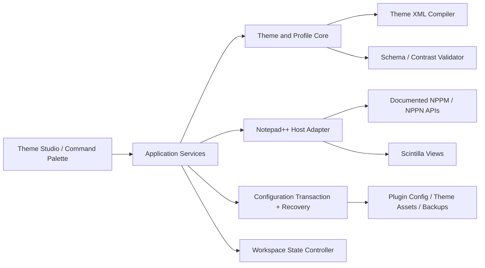

# NppThemes Development Plan

**Status:** Initial plan

**Last updated:** 2026-07-15

**Working product name:** NppThemes

## 1. Product outcome

NppThemes will make Notepad++ feel coherent, modern, and personal while preserving the speed, reliability, and small footprint that make Notepad++ valuable.

The product will provide:

- A polished Theme Studio for choosing, previewing, creating, importing, exporting, and restoring appearance profiles.
- A semantic theme system: users edit roles such as `editor.background`, `text.muted`, `accent`, `selection`, and `diagnostic.error` instead of hundreds of unrelated style values.
- Complete editor themes generated for every built-in lexer, with controlled per-language overrides.
- Reversible workspace profiles that can reduce native chrome for focused editing without trapping users in a layout they cannot restore.
- A fast command palette for theme, workspace, navigation, and common Notepad++ commands.
- First-class keyboard navigation, high-DPI behavior, dark/light integration, and contrast guidance.
- Local-only settings, no telemetry, no account requirement, and no network dependency for core use.

Success means a new user can install the plugin, preview a preset, apply it safely, understand what changed, and restore the prior state in under two minutes.

## 2. Delivery decision: hybrid plugin, not a host fork

### Selected approach

Build a **native C++ plugin plus generated Notepad++ theme assets**.

The official plugin surface exposes host messages and notifications for dark-mode-aware plugin UI, toolbar icons, docking panels, Scintilla editor access, and showing or hiding menu, toolbar, tab bar, and status bar. Notepad++ themes already carry lexer colors, fonts, and style settings in XML. Combining these mechanisms gives meaningful visual change without maintaining a permanent fork.

### Compatibility boundary

- Use only documented `NPPM_*`, `NPPN_*`, Scintilla, Win32, and documented theme/configuration contracts.
- Never depend on `NPPM_INTERNAL_*`, private child-window layout, binary patching, DLL injection, or undocumented class names.
- Never replace Notepad++ title bar, menu bar, toolbar, or tab bar by subclassing private host windows in stable releases.
- A workspace profile may hide documented host elements only when it also provides an obvious restore command and crash-safe recovery.

Notepad++ documentation warns that internal messages can change or disappear and can make a plugin crash the host. This is a hard product boundary, not merely a coding preference.

### Why not other approaches?

| Approach | Strength | Problem | Decision |
|---|---|---|---|
| Theme files only | Safe, simple, native | Cannot provide friendly editing, preview, profiles, rollback, or command UI | Use as generated output, not whole product |
| Plugin only, runtime styles only | Live and interactive | Runtime styles can be reset by lexer/theme events; weak portability | Combine with persistent theme assets |
| Unsupported host-window reskin | Maximum apparent control | Fragile across Notepad++ and Windows updates; crash risk | Prohibited in stable channel |
| Maintained Notepad++ fork | Complete frame control | Large maintenance, distribution, trust, and update burden | Reconsider only as separate future product |
| Native plugin + theme assets | Good reach, safety, and user experience | Requires careful persistence and compatibility work | Selected |

If user research later proves full frame replacement essential, create a separate fork feasibility proposal. Do not let experimental host manipulation leak into Plugin Admin builds.

## 3. Product principles

1. **Reversible by default.** Every persistent change has a preview, backup, summary, and restore path.
2. **Supported APIs only.** Visual polish must not trade away editor stability.
3. **Fast at rest.** No polling loop, no editor keystroke interception unless a feature explicitly needs it, and no background network work.
4. **Progressive complexity.** Presets work immediately; advanced controls stay available without crowding first-run experience.
5. **Accessible customization.** Contrast warnings inform rather than block; keyboard and screen-reader paths remain complete.
6. **Portable profiles.** User-created profiles are versioned, readable, and exportable without machine-specific paths.
7. **Host-respectful behavior.** Detect and preserve existing Notepad++ choices rather than silently replacing them.

## 4. Target user experience

### First run

1. Plugin detects Notepad++ version, architecture, portable/installed settings mode, current theme mode, and relevant UI visibility state.
2. Theme Studio explains three safe actions: preview, apply, and restore.
3. User selects a curated preset or starts from current appearance.
4. Live preview updates both editor views without changing files.
5. Apply screen lists persistent changes before confirmation.
6. Plugin creates a recovery snapshot, applies supported runtime changes, installs a versioned theme asset when needed, and reports whether restart or one manual Notepad++ selection is required.
7. Persistent “Restore previous appearance” command remains available from Plugins menu and recovery mode.

### Theme Studio

Theme Studio is a dark-mode-aware dockable panel with:

- Preset gallery with light, dark, high-contrast, low-distraction, and color-vision-friendly options.
- Semantic palette editor with hex/RGB input, color picker, history, linked roles, and reset-per-field.
- Typography controls for family, size, weight, italic, line spacing where supported, font quality, and ligatures only when host support is verified.
- Editor controls for selection, caret, current line, whitespace, indent guides, margins, edge, matching braces, search marks, and diagnostics.
- Per-language override browser with search, “changed only” filtering, and inheritance visualization.
- Real code previews for representative languages and plain text.
- Contrast checks for important foreground/background pairs using WCAG ratios as guidance.
- Import/export with validation and a human-readable change summary.

### Workspace profiles

Initial profiles:

- **Classic+**: native layout retained; theme and polish only.
- **Focus**: reduces low-value chrome while keeping tabs and status information.
- **Minimal**: hides supported host chrome and relies on command palette plus document navigator; always exposes an emergency restore shortcut.
- **Presentation**: larger type, strong contrast, simplified chrome, and reversible distraction reduction.

Each profile records the previous menu, toolbar, tab bar, status bar, panel, font-smoothing, and editor-border state. Exit restores exact prior values rather than assumed defaults.

### Command palette

Keyboard-first popup supporting:

- Switch theme or workspace profile.
- Open Theme Studio or restore prior appearance.
- Find and activate an open document.
- Run an allowlisted set of documented Notepad++ menu commands.
- Search settings by plain-language labels.

## 5. Scope

### Minimum viable product

- Native plugin loads cleanly in supported Notepad++ builds.
- Dark-mode-aware Theme Studio shell.
- Semantic profile schema and six curated local presets.
- Live preview in both Scintilla views.
- Coverage for plain text plus at least ten high-use built-in languages.
- Install/export of a complete Notepad++ theme XML without deleting unknown styles.
- Backup, restore, preview cancel, and startup recovery.
- Classic+ and Focus profiles.
- Import/export of versioned profile JSON.
- x64 package and documented manual installation.

### Version 1.0

- Complete built-in language/style coverage for the supported Notepad++ range.
- Polished Theme Studio, command palette, and document navigator.
- Classic+, Focus, Minimal, and Presentation profiles.
- x64, x86, and ARM64 packages if host/API testing passes.
- Installed, portable, cloud-settings, and `-settingsDir` compatibility.
- High-DPI and multi-monitor support at 100%, 125%, 150%, 175%, and 200% scaling.
- Keyboard-only and screen-reader-compatible primary flows.
- Signed or CI-attested release archives with SHA-256 checksums.
- GitHub release pipeline and Plugins Admin submission.

### Later candidates

- User-shareable theme packs with detached signatures and an explicit trust model.
- Optional toolbar icon packs using documented Notepad++ toolbar customization.
- Theme variants generated from a base palette.
- Schedule/system-mode switching if Notepad++ exposes a reliable supported activation path.
- Community gallery, only after moderation, update integrity, and privacy design exist.
- Separate Notepad++ fork study for full application-frame redesign.

### Explicit non-goals for 1.0

- Replacing Notepad++ editor engine.
- Shipping a self-updater.
- Telemetry, accounts, ads, or mandatory cloud services.
- Downloading executable code or arbitrary themes at runtime.
- Modifying Notepad++ executable or private host windows.
- Editing arbitrary user configuration without backup and confirmation.
- Claiming all UI colors are controllable when Windows or Notepad++ owns them.

## 6. Technical architecture



### 6.1 Plugin shell

- Native C++20 DLL using official Notepad++ plugin entry points and current public headers.
- Thin lifecycle layer: `setInfo`, commands array, notifications, load/unload, and exception containment.
- No heavy work in `DllMain`.
- Top-level callbacks catch failures, log redacted diagnostics locally, and fail closed without taking down host where possible.
- One plugin folder and DLL basename, `NppThemes`, matching Plugins Admin packaging rules.

### 6.2 Host adapter

Typed wrappers around documented host and Scintilla messages:

- Host version and architecture capability checks.
- Two-view discovery and active-document tracking.
- Dark-mode state, dark palette, and `NPPN_DARKMODECHANGED` handling.
- Docking registration and modeless-dialog keyboard registration.
- Toolbar/menu/tab/status visibility queries and changes.
- Document enumeration and activation using current non-deprecated APIs.
- Font smoothing, editor border, and other documented visual switches.
- Menu command dispatch through an explicit allowlist.

Every wrapper declares minimum host version, input lifetime, expected return type, and fallback behavior. Unsupported capability means disabled UI with explanation, never an unverified message send.

### 6.3 Semantic theme core

Host-independent static library containing:

- Versioned profile data model.
- Semantic color roles and inheritance graph.
- Deterministic color transforms with gamut/clamping rules.
- Lexer/style mapping tables.
- Typography and editor-setting model.
- Contrast and indistinguishability checks.
- Profile merge, diff, migration, validation, and canonical serialization.

Core must have no Win32 dependency so most behavior can be unit-tested quickly.

### 6.4 Live preview engine

- Snapshot affected Scintilla styles and supported workspace state before preview.
- Apply runtime style changes to both views.
- Reapply only required styles after buffer, language, word-style, or dark-mode notifications.
- Coalesce rapid slider/color changes; never run expensive full-theme work per keystroke.
- Cancel restores the snapshot exactly.
- Plugin shutdown during preview restores or records a recovery marker before exit.

Phase 0 must prove which global and lexer-specific styles can be applied reliably at runtime. Unsupported fields remain persistent-theme-only and are labeled in UI.

### 6.5 Persistent theme compiler

- Start from the target Notepad++ installation's current `stylers.model.xml` for light profiles or `DarkModeDefault.xml` for dark profiles when available.
- Preserve unknown languages, style IDs, keywords, extensions, and attributes.
- Overlay only profile-owned values.
- Produce deterministic, formatted XML with UTF-8 encoding and strict escaping.
- Validate XML structure and required nodes before installation.
- Write a new versioned theme file through temp-file plus atomic rename; do not edit the active source theme in place.
- Store source-version metadata so schema drift can be detected and themes can be regenerated after Notepad++ upgrades.

One-click activation is a Phase 0 research item. If no public activation API is reliable, use runtime application plus a guided native Style Configurator step or restart workflow. Never patch live `config.xml` merely to simulate one click.

### 6.6 Configuration transaction and recovery

- Use documented host paths; never assume `%AppData%` when portable, cloud, or `-settingsDir` modes may apply.
- Keep plugin-owned settings under Notepad++ plugin config path.
- Before persistent changes, capture file path, existence, SHA-256, timestamps, and backup copy in a transaction manifest.
- Restrict writes to known configuration roots after canonical path validation.
- Apply temp-write, validation, atomic replace, and post-write verification.
- Retain bounded backup history with explicit pin/delete controls.
- On startup, detect incomplete transactions and offer restore before normal initialization.
- Provide command-line-independent emergency recovery instructions in repository docs and release notes.

### 6.7 Workspace state controller

- Query current host visibility/status before applying a profile.
- Store exact prior state and profile owner token.
- Apply only documented show/hide or visual messages.
- Restore only fields still owned by NppThemes; preserve user changes made after profile activation where detectable.
- Register a fixed “Restore Notepad++ UI” command and default keyboard shortcut.
- On abnormal prior shutdown, start with native chrome visible unless user explicitly disabled recovery behavior.

### 6.8 UI technology

Start with Win32 controls and owner-drawing only where it materially improves presentation. Use Notepad++ dark-mode subclass/theming API for plugin dialogs and docking behavior. Use Direct2D/DirectWrite for preview surfaces only after proving DPI, device-loss, and accessibility behavior.

Avoid embedding WinUI 3 or a browser runtime in 1.0: deployment size, runtime dependencies, focus integration, and Plugins Admin packaging costs outweigh benefit. Custom-drawn interactive controls require explicit UI Automation support or a native-control fallback.

### 6.9 Profile format

Illustrative shape:

```json
{
  "schemaVersion": 1,
  "id": "builtin.northern-lights",
  "name": "Northern Lights",
  "mode": "dark",
  "palette": {
    "editor.background": "#11151C",
    "editor.foreground": "#D8DEE9",
    "accent": "#7DD3FC",
    "selection.background": "#294B63"
  },
  "typography": {
    "fontFamily": "Cascadia Mono",
    "fontSizePt": 11
  },
  "workspace": "classic-plus",
  "languageOverrides": {}
}
```

Rules:

- Unknown fields are retained when safely possible for forward compatibility.
- Machine-specific paths are forbidden in exported profiles.
- Built-in profiles are immutable; customization creates a user copy.
- Migrations are one-way internally, with original file retained until successful save.
- Imports have size, nesting, string-length, and identifier limits.

## 7. Proposed repository layout

```text
/
├─ cmake/
├─ docs/
│  ├─ adr/
│  ├─ compatibility/
│  ├─ recovery.md
│  └─ user-guide/
├─ include/npp/                 # pinned public Notepad++/Scintilla headers
├─ resources/
│  ├─ icons/
│  ├─ previews/
│  └─ themes/builtin/
├─ src/
│  ├─ NppThemes.Plugin/         # ABI entry points and event routing
│  ├─ NppThemes.Host/           # typed Notepad++/Scintilla adapter
│  ├─ NppThemes.Core/           # profiles, compiler, validation
│  ├─ NppThemes.Storage/        # transactions, backup, migration
│  └─ NppThemes.UI/             # panel, palette, accessible controls
├─ tests/
│  ├─ unit/
│  ├─ golden/
│  ├─ host-harness/
│  └─ ui/
├─ tools/
│  ├─ theme-compiler/
│  └─ package/
├─ CMakeLists.txt
├─ CMakePresets.json
├─ DEVELOPMENT_PLAN.md
└─ README.md
```

## 8. Development phases

Estimates assume one experienced Windows/C++ engineer and are planning ranges, not release promises.

### Phase 0 — feasibility and API proof (1–2 weeks)

Deliverables:

- Pin current official plugin template and public headers.
- Prototype load/unload, commands, notifications, and dark-aware docked dialog.
- Demonstrate live styling of both Scintilla views across language switches.
- Demonstrate query/apply/restore for documented chrome visibility states.
- Determine safest persistent theme installation and activation workflow.
- Test standard, portable, cloud, and `-settingsDir` path discovery.
- Record API/version capability matrix and Architecture Decision Records.

Exit gate:

- No private API required for MVP.
- Recovery path works after forced host termination during preview/apply.
- Supported minimum Notepad++ version chosen from evidence.
- If significant appearance goal cannot be met safely, rescope before building UI.

### Phase 1 — engineering foundation (1–2 weeks)

Deliverables:

- CMake/MSVC build with x64 Debug and Release presets.
- Plugin ABI shell, typed host adapter, structured local logging, and exception boundaries.
- Core library and initial profile schema.
- Unit-test framework, formatting, static analysis, CI, dependency policy, and packaging skeleton.
- Architecture docs and contributor setup.

Exit gate:

- Clean build from fresh Windows CI runner.
- Plugin repeatedly loads/unloads in portable Notepad++ without leak or crash.
- Unit and ABI smoke suites pass.

### Phase 2 — theme engine MVP (2–3 weeks)

Deliverables:

- Semantic palette, inheritance, typography, and style maps.
- Six curated profiles with representative code samples.
- Live preview, cancel, apply, import, export, and profile migrations.
- Theme XML compiler with golden tests and unknown-style preservation.
- Transactional install, backup, rollback, and interrupted-write recovery.

Exit gate:

- Preview survives buffer/view/language changes.
- Generated XML validates and loads without warning.
- Apply/cancel/restore tests leave unrelated user settings byte-for-byte unchanged.

### Phase 3 — polished Theme Studio (3–4 weeks)

Deliverables:

- Onboarding, gallery, semantic editor, typography, per-language overrides, diffs, and help.
- Dark/light adaptation and host palette integration.
- Keyboard navigation, focus management, screen-reader names, high contrast, and DPI behavior.
- Contrast and color-confusion guidance.
- Error UX with actionable recovery, not raw exception text.

Exit gate:

- Primary flows complete without mouse.
- UI passes manual checks at all target DPI levels and Windows high-contrast mode.
- Five unfamiliar testers can preview, apply, export, and restore without developer help.

### Phase 4 — workspace modernization (2–3 weeks)

Deliverables:

- Classic+, Focus, Minimal, and Presentation profiles.
- Command palette and document navigator.
- State ownership, emergency restore shortcut, and crash recovery.
- Performance tuning and command allowlist review.

Exit gate:

- Every profile can return to exact starting state.
- Forced termination in Minimal mode does not strand user without native UI on next start.
- No idle polling and no measurable editor-input regression.

### Phase 5 — compatibility and hardening (2–3 weeks)

Deliverables:

- Complete lexer/style coverage.
- x86 and ARM64 builds if feasible.
- Stable/minimum-version, installed/portable/settings-mode matrix.
- Fuzz/property tests for profile and XML inputs.
- Long-run switching, multi-instance, dual-view, shutdown, and upgrade tests.
- Security review, threat model, recovery drill, documentation, and localization readiness.

Exit gate:

- Zero known data-loss or host-crash defects.
- All P0/P1 defects closed; P2 defects documented and accepted.
- Compatibility matrix and known limitations published.

### Phase 6 — 1.0 release and Plugins Admin (1–2 weeks)

Deliverables:

- SemVer release, changelog, checksums, provenance/attestation, install and recovery guides.
- GitHub Release archives per architecture.
- Plugin Admin package validation and `nppPluginList` pull request.
- Support templates and responsible vulnerability-reporting path.

Exit gate:

- Clean install, update, and removal pass using Plugin Admin test flow.
- Release archive layout matches DLL/folder naming rules.
- Rollback from 1.0 to clean native Notepad++ verified.

Indicative total: **12–19 engineering weeks**, excluding code-signing procurement, broad community beta time, or a separate host fork.

## 9. Testing strategy

### Automated tests

- Unit tests for colors, inheritance, diffs, migrations, validation, capability rules, and path policy.
- Golden tests for generated XML and built-in profile JSON.
- Round-trip tests: import → normalize → export → import.
- Property tests for arbitrary palettes, Unicode names, numeric bounds, and inheritance cycles.
- Fuzz tests for JSON/XML imports and corrupt recovery manifests.
- Host-adapter contract tests with fake `SendMessage` boundary.
- Portable Notepad++ smoke harness that installs package, launches host, verifies plugin discovery, executes scripted commands where reliable, and inspects clean shutdown.
- Package tests for exact archive root, DLL/folder basename, version resources, architecture, SHA-256, and forbidden files.

### Manual and UI tests

Test matrix:

| Dimension | Coverage |
|---|---|
| Notepad++ | Minimum supported, latest stable, latest pre-release before release candidates |
| Architecture | x64 required; x86 and ARM64 before 1.0 if supported |
| Windows | Windows 10 22H2 and maintained Windows 11 releases |
| Install mode | Standard, portable, cloud settings, custom `-settingsDir` |
| Display | 100%, 125%, 150%, 175%, 200%; mixed-DPI monitors |
| Appearance | Host light, host dark, Windows high contrast |
| Editor | Single/dual view, many tabs, large files, long paths, RTL/Unicode filenames |
| Lifecycle | First run, upgrade, downgrade, crash during apply, uninstall, multi-instance |

Visual baselines cover plugin-owned surfaces only; minor OS rendering variance must not create noisy tests.

### Performance budgets

- Added plugin startup work: target under 25 ms on reference machine, excluding first-run migration.
- Open warm Theme Studio: target under 100 ms.
- Coalesced live preview update: target under 50 ms for visible styles.
- Idle CPU: effectively zero; no periodic polling.
- Editor typing/scrolling: no statistically meaningful regression in representative large files.
- Plugin-owned memory at idle: target under 30 MB, reviewed after real prototype measurements.

Budgets can change after Phase 0 measurement, but regression tests must enforce chosen values.

## 10. Security, privacy, and data safety

- Plugin runs in Notepad++ process and is therefore high trust; keep dependency count low and pin reviewed versions.
- No network access or telemetry in 1.0.
- No self-update; use GitHub Releases and Plugins Admin.
- Canonicalize paths and enforce allowed roots before all writes.
- Reject path traversal, external entities, oversized inputs, deeply nested profiles, invalid UTF, and unsupported schema versions.
- Escape XML and never execute profile content.
- Use bounded, redacted logs; never record file contents, full recent-file lists, credentials, or environment secrets.
- Build releases in GitHub Actions from tags, publish SHA-256 checksums and attestations, and add Authenticode signing when a sustainable certificate process exists.
- Run CodeQL/static analysis and dependency scanning in CI.
- Document vulnerability reporting before beta.
- Treat failed backup, validation, or post-write verification as a hard stop.

## 11. Build, CI, and release design

### Build

- C++20, MSVC, CMake presets, warning level `/W4`, warnings-as-errors for project code.
- Keep ABI boundary free of exceptions and STL types.
- Prefer Windows system APIs and small vendored/header-only dependencies only after review.
- Pin public Notepad++ and Scintilla headers to a recorded upstream commit; update through reviewed pull requests.
- Generate DLL version resource from project version.

### Pull-request gates

- Format check.
- x64 Debug/Release build.
- Unit, golden, schema, and package tests.
- Static analysis and CodeQL.
- License/dependency inventory.
- Changed built-in themes require preview artifact and golden diff review.
- Changed public host headers require compatibility-matrix review.

### Release pipeline

1. Merge release PR containing version, changelog, compatibility matrix, and migration notes.
2. Create signed/annotated tag from protected main branch.
3. CI builds each architecture from clean runners.
4. CI runs tests and packages one zip per architecture with `NppThemes.dll` at archive root.
5. Publish checksums, SBOM, and build attestation with GitHub Release.
6. Validate package through local Plugins Admin test list.
7. Submit/update official `nppPluginList` entry with exact version, compatibility range, download URL, and SHA-256.
8. Monitor crash/support reports; keep previous release assets available for rollback.

## 12. Risk register

| Risk | Impact | Likelihood | Mitigation / gate |
|---|---:|---:|---|
| Public API cannot control enough host appearance | High | High | Hybrid theme strategy; Phase 0 proof; honest capability labels; fork remains separate option |
| Runtime styles reset on language/theme events | High | High | Event-driven reapply, persistent generated theme, integration matrix |
| Notepad++ overwrites configuration on exit | High | Medium | Avoid live `config.xml` edits; new-file installs; transactions; post-exit/restart workflow |
| Theme schema changes across Notepad++ versions | High | High | Compile from current model XML, preserve unknown nodes, pin/test version range |
| Plugin defect crashes host process | High | Medium | Small native surface, exception containment, no private subclassing, stress tests |
| Minimal profile hides recovery controls | High | Medium | Fixed restore command/shortcut, prior-state snapshot, startup safe mode |
| Custom UI harms accessibility | High | Medium | Native controls first, UI Automation, keyboard test gate, high-contrast fallback |
| DPI/device-loss bugs degrade modern UI | Medium | Medium | Per-monitor DPI handling, mixed-DPI matrix, limited custom drawing |
| Font not installed or lacks glyphs | Medium | High | Font fallback chain, preview warnings, never bundle fonts without license review |
| Import writes outside config root | High | Low | No paths in profiles, canonical-root enforcement, adversarial tests |
| Plugin Admin architecture/package mismatch | Medium | Medium | CI package assertions and official local validation flow |
| Project scope drifts toward full IDE replacement | High | Medium | Product principles, milestone gates, explicit non-goals, issue triage rubric |

## 13. Quality gates and definition of done

A feature is done only when:

- User-visible behavior and failure states have acceptance criteria.
- Supported-version and fallback behavior are declared.
- Unit/integration tests cover normal, invalid, cancel, and recovery paths.
- Keyboard, dark/light, high-contrast, and DPI behavior are checked when UI changes.
- Persistent writes use transaction/rollback service.
- Performance impact is measured when event handling or startup changes.
- User documentation and migration notes are updated.
- No undocumented Notepad++ API is introduced.

Version 1.0 is done only when:

- Theme apply and restore never lose unrelated user settings in test matrix.
- No known host crash, data-loss, path-escape, or unrecoverable-hidden-UI defect remains.
- All built-in profiles pass contrast review and all supported lexers have intentional mappings.
- Clean install, upgrade, downgrade, uninstall, and crash recovery are documented and tested.
- Plugin package passes official Plugins Admin validation flow.
- Compatibility matrix and limitations are public.

## 14. Initial implementation backlog

Create these issues after Phase 0 starts:

1. `SPIKE: Validate public API capability matrix`
2. `SPIKE: Prove dual-view runtime style snapshot/apply/restore`
3. `SPIKE: Determine safe persistent theme activation workflow`
4. `SPIKE: Validate standard/portable/cloud/-settingsDir paths`
5. `ADR: Stable plugin boundary and prohibited host manipulation`
6. `ADR: UI toolkit and accessibility strategy`
7. `BUILD: CMake, MSVC presets, CI, and package skeleton`
8. `CORE: Profile schema, semantic roles, migrations, and validation`
9. `CORE: Current-model-preserving theme XML compiler`
10. `STORAGE: Transaction, backup, rollback, and recovery service`
11. `HOST: Typed Notepad++ and Scintilla adapters`
12. `UI: First-run and Theme Studio vertical slice`
13. `UX: Emergency restore and recovery-mode design`
14. `TEST: Portable host smoke harness and compatibility matrix`

Issue templates must require acceptance criteria, API/version impact, data-write impact, accessibility impact, and rollback notes.

## 15. Decisions and open questions

### Decisions made

- Product form: native plugin plus generated theme assets.
- Stable channel uses documented APIs only.
- Language: C++20 with a narrow C-compatible plugin ABI boundary.
- Core operation is offline and local-only.
- User changes are transactional and reversible.
- Plugin UI prioritizes native accessibility over novelty.
- Full Notepad++ frame replacement is outside stable plugin scope.

### Resolve during Phase 0/1

- Final product/repository branding and plugin DLL name.
- Minimum supported Notepad++ release, based on tested dark-mode and settings-path capabilities.
- Project license before accepting external code contributions or copying template code.
- Code-signing funding and certificate ownership.
- Exact built-in theme visual directions and font policy.
- Whether ARM64 reaches 1.0 or follows shortly after.
- Whether reliable one-action persistent activation exists through public APIs.

## 16. Authoritative upstream references

- [Notepad++ plugin development and Plugins Admin rules](https://npp-user-manual.org/docs/plugins/)
- [Notepad++ plugin messages and notifications](https://npp-user-manual.org/docs/plugin-communication/)
- [Notepad++ themes](https://npp-user-manual.org/docs/themes/)
- [Notepad++ configuration file locations and lifecycle](https://npp-user-manual.org/docs/config-files/)
- [Current public Notepad++ plugin header](https://github.com/notepad-plus-plus/notepad-plus-plus/blob/master/PowerEditor/src/MISC/PluginsManager/Notepad_plus_msgs.h)
- [Official Notepad++ C++ plugin template](https://github.com/npp-plugins/plugintemplate)
- [Official Plugins Admin repository](https://github.com/notepad-plus-plus/nppPluginList)

Pin exact upstream commits during Phase 0. Documentation links above explain intent; pinned source headers and verified host behavior control implementation.
