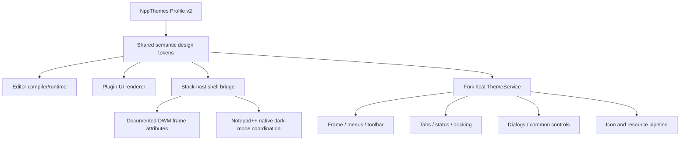

# NppThemes Full-Window Theming Development Plan

**Status:** Active implementation plan

**Created:** 2026-07-16
**Target outcome:** One coherent, highly customizable visual system covering editor, title bar, menus, toolbar, tabs, status bar, panels, dialogs, icons, and workspace behavior.

**Plan authority:** This document extends and supersedes the full-window and fork-related scope in `DEVELOPMENT_PLAN.md`. That document remains authoritative for the stock-plugin product through 1.0. When the documents differ about host-owned chrome, fork delivery, or shared shell tokens, this roadmap controls.

## 1. Outcome and product shape

Complete-window theming cannot be delivered responsibly by a normal Notepad++ plugin alone. Public plugin APIs expose editor styling, plugin-owned dark dialogs, toolbar icons, menu commands, and chrome visibility. They do not expose arbitrary color or rendering control for host-owned title bar, menu bar, toolbar, tab bars, status bar, splitters, or built-in dialogs.

Development therefore produces two related deliverables sharing one theme format and design system:

1. **NppThemes Plugin** — Plugin Admin-compatible, low-risk enhancement for stock Notepad++. It controls editor styles, plugin surfaces, documented workspace state, generated native themes, compatible toolbar icons, and documented Windows frame attributes.
2. **NppThemes Shell** — Maintained Notepad++ distribution/fork. It integrates a host-level theme service and can render every application-owned surface from the same profile.

Users who want stock Notepad++ compatibility install the plugin. Users who want full visual replacement install NppThemes Shell. The shell does **not** load or bundle the stock plugin DLL: it consumes the pinned shared core and owns Theme Studio, profile persistence, preview/apply, and shell rendering itself. This single-authority rule prevents two components from racing to apply the same profile.

## 2. Non-negotiable boundaries

- Stable plugin never patches binaries, injects code, sends `NPPM_INTERNAL_*`, discovers private child windows by class name, or subclasses host chrome.
- Experimental private-window manipulation never ships through Plugins Admin.
- Full-shell control happens in maintained source fork where ownership and message handling are explicit.
- Every visual change remains reversible. Failed initialization falls back to native usable UI.
- User documents, sessions, shortcuts, plugins, and settings remain compatible wherever upstream formats permit.
- Core operation remains local-only: no account, telemetry, ad system, runtime executable download, or self-updater inside plugin.
- Accessibility, high contrast, keyboard navigation, and DPI correctness are release gates, not later polish.
- Windows forced High Contrast always wins. Custom shell rendering is disabled unless that exact path is verified accessible; a profile cannot override forced system policy.
- Security review starts with the profile and asset formats and continues in every phase; Phase 10 is the final release audit, not the first security work.
- Upstream Notepad++ security fixes must be mergeable quickly and visibly.

## 3. Definition of “complete window”

Target coverage includes:

| Surface | Stock plugin target | Shell target |
|---|---|---|
| Scintilla editor and lexers | Full semantic styling | Full semantic styling |
| Selection, caret, margins, guides | Full | Full |
| Plugin panels and command palette | Full | Full |
| Windows title bar, caption text, border | Documented DWM attributes where supported | Full custom/native frame strategy |
| Main menu and context menus | Native Notepad++ dark mode only | Full palette and state styling |
| Toolbar background and icons | Compatible icon contribution only | Full layout, icon, hover, pressed, disabled styling |
| Document tabs | Host-native only | Full active/inactive/hover/dirty/pinned states |
| Status bar | Host-native only | Full segments, separators, typography, colors |
| Splitters, docking chrome, panel tabs | Plugin-owned surfaces only | Full |
| Built-in dialogs | Cannot restyle safely | Full common-control and custom-dialog theming |
| Scrollbars and native controls | OS/host behavior | Controlled where accessibility-safe |
| File switcher, search, preferences | Host-native | Full shell theme integration |
| Start page, empty editor, notifications | Limited | Full |

“Full” means every surface owned by the NppThemes Shell application. It intentionally excludes third-party plugin windows, OS-owned file pickers and system dialogs, IME/accessibility overlays, driver/compositor output, and pixels rendered by external processes. Those surfaces receive system light/dark/high-contrast behavior where available, not unsafe forced paint hooks.

## 4. Architecture



### 4.1 Shared profile and token engine

Profile v2 becomes common contract between plugin and shell. It contains semantic roles rather than direct HWND/control assumptions.

Required shell roles:

- `shell.window.background`
- `shell.surface.primary`, `secondary`, and `raised`
- `shell.border`, `divider`, and `focusRing`
- `shell.caption.background`, `foreground`, and `inactiveForeground`
- `shell.menu.background`, `foreground`, `hotBackground`, and `disabledForeground`
- `shell.toolbar.background`, `hover`, `pressed`, and `separator`
- `shell.tab.active`, `inactive`, `hover`, `foreground`, `dirty`, and `closeHover`
- `shell.status.background`, `foreground`, and `separator`
- `shell.scrollbar.track`, `thumb`, and `thumbHover`
- `shell.control.background`, `foreground`, `border`, `hover`, `pressed`, and `disabled`
- `shell.dialog.background`, `surface`, `foreground`, and `muted`
- `shell.icon.foreground`, `muted`, `accent`, `warning`, and `error`

Token engine supplies deterministic defaults from existing editor palette, explicit overrides, contrast validation, state derivation, and light/dark/high-contrast variants.

Profile v2 carries colors, metrics, density, typography preferences, and semantic icon-role preferences only. It does not embed fonts, executable code, DLLs, scripts, or arbitrary binary assets. The first shell release uses audited built-in icon and font fallback assets. A separate signed theme-pack format may be designed later with explicit size, type, license, and trust limits; it is not part of profile v2.

### 4.2 Stock-host shell bridge

Plugin-side bridge handles only documented surfaces:

- DWM caption, caption-text, and border color attributes on supported Windows builds.
- Exact snapshot and restoration of any frame attributes changed by NppThemes.
- Notepad++ native dark-mode observation and plugin UI synchronization.
- Dark/light toolbar icon variants for NppThemes commands.
- Capability report explaining which profile roles stock Notepad++ cannot apply.
- No private control discovery or main-window subclassing.

### 4.3 Fork host `ThemeService`

Fork receives central `ThemeService` owned by main application. It:

- Parses validated shared profile.
- Resolves all derived tokens once per profile change.
- Publishes typed theme-change event to every themed surface.
- Exposes brushes, pens, fonts, metrics, icon colors, and state palettes without global mutable color constants.
- Owns native dark-mode/DWM integration.
- Detects Windows high contrast and disables unsafe custom rendering.
- Provides atomic preview, apply, cancel, and fallback behavior.

No individual control parses JSON or invents colors. Controls consume resolved tokens from `ThemeService`.

### 4.4 Delivery and ownership contract

- `npp-themes` remains the canonical source for the profile parser, migration, validation, `ShellPalette`, fixtures, and standalone conformance harness.
- The shell fork imports a reviewed, commit-pinned Git subtree under `PowerEditor/src/NppThemesCore`; subtree updates name the source commit in the merge message.
- The conformance harness emits canonical JSON token snapshots. Plugin and shell must match every field byte-for-byte for all golden fixtures before merge.
- Fork-specific controls never enter the Plugin Admin DLL. The plugin DLL is neither installed nor loaded in NppThemes Shell.

### 4.5 Workstream order

After Phase 0, two lanes may proceed in parallel: Lane A is Phases 1–2 for shared core and safe stock-plugin coverage; Lane B begins Phase 3 fork bootstrap as soon as a shared-core commit is pinned. Phase 4 depends on Phases 1 and 3. Phases 5–12 are shell integration and qualification in order. Phase 2 is valuable but is not a prerequisite for fork bootstrap.

## 5. Development process

### Phase 0 — Requirements, baseline, and upstream strategy

**Work**

1. Freeze precise visual coverage table and supported Windows/Notepad++ range.
2. Capture stock light/dark screenshots and behavior at target DPI values.
3. Inventory every host-owned surface and current implementation class/resource.
4. Record which surfaces use Win32 common controls, custom painting, Scintilla, UxTheme, DWM, or resource bitmaps.
5. Choose upstream fork/mirror structure, branch naming, branding rules, and sync cadence; rehearse the proposed sync against a temporary read-only worktree.
6. Confirm GPL obligations, source distribution, third-party licenses, and branding separation.
7. Threat-model profile parsing, asset loading, persistent paths, and future distribution before those formats freeze.
8. Define measurable compatibility and visual acceptance criteria.

**Exit gate**

- Surface inventory covers 100% of application-owned top-level surfaces and names an owner/rendering path for each.
- Temporary sync rehearsal records upstream base, commands, conflicts, and build result; the permanent rehearsal repeats in Phase 3.
- No feature depends on binary patching.
- Product names and distribution paths cannot be confused with official Notepad++.
- No unresolved P0/P1 threat-model finding.

### Phase 1 — Shared shell-token foundation

**Work**

1. Add host-independent `ShellPalette` model derived from existing profile.
2. Use the v1-compatible shell derivation to gather fixtures, then freeze canonical profile v2 JSON and v1-to-v2 migration.
3. Add override/inheritance rules and unknown-field preservation.
4. Add contrast and color-confusion checks for every text/state pair.
5. Add deterministic light, dark, high-contrast, and color-vision-friendly derivation.
6. Add profile diff explaining editor-only, stock-shell, and full-shell effects.
7. Create at least 12 golden fixtures: six built-ins, two custom light/dark profiles, two minimum/maximum metric profiles, one unknown-field fixture, and one hostile invalid fixture.
8. Build the standalone canonical-token conformance executable in this repository before the fork consumes the core.

**Exit gate**

- Every golden fixture resolves byte-identical canonical tokens in standalone, plugin, and shell harnesses.
- Existing v1 fixtures preserve every editor role and produce only documented derived shell defaults.
- Invalid or hostile profiles fail before host state changes.
- All foreground/background text pairs meet 4.5:1 and focus/non-text indicators meet 3:1, except explicitly recorded large-text pairs allowed by WCAG at 3:1.

### Phase 2 — Maximum safe stock-plugin coverage

**Work**

1. Implement reversible documented DWM title-bar color integration.
2. Add shell capability detection and user-facing support matrix.
3. Reapply compatible frame state after host dark-mode changes without polling.
4. Add NppThemes toolbar command icons for light/dark/high-contrast modes.
5. Add “Shell Profile” section to Theme Studio showing applied and unavailable roles.
6. Coordinate profile guidance with native Notepad++ dark mode without editing live host config.
7. Add opt-in setting for custom frame colors and exact restore command.
8. Test stock plugin on Windows 10/11, supported architectures, DPI, high contrast, and remote desktop.

**Exit gate**

- No private API or host subclassing.
- Cancel and disable restore the exact DWM values captured in the current process. Process exit or uninstall leaves no persistent Windows setting, so the next launch starts native. Crash recovery clears the opt-in startup marker before any reapply if the previous apply did not complete.
- Plugin Admin compatibility preserved.
- UI labels clearly distinguish applied roles from shell-only roles.
- Tests cover supported, unsupported, partial-failure, restore, High Contrast, and repeated-apply paths with zero P0/P1 failures.

### Phase 3 — Fork bootstrap and reproducible upstream baseline

**Work**

1. Create public fork repository from pinned official Notepad++ commit.
2. Add `upstream` remote and documented sync branches; repeat and record the permanent sync rehearsal.
3. Produce unmodified reproducible x64/x86/ARM64 builds first.
4. Run official test/build pipeline before any visual changes.
5. Add fork-only namespace/branding, executable name, icons, config root, and update channel.
6. Preserve ability to open same files and import Notepad++ settings.
7. Add automated weekly upstream security/update check with conflict report.

**Exit gate**

- Clean fork build matches upstream behavior.
- Upstream patch can be merged and rebuilt in one documented operation.
- Fork installs beside official Notepad++ without overwriting it.

### Phase 4 — Host ThemeService integration

**Work**

1. Add `ThemeService`, resolved-token types, and theme-change subscription interface.
2. Replace scattered global dark-mode color reads with service access behind adapters.
3. Integrate preview transaction: snapshot, apply, broadcast, cancel, restore.
4. Add safe-mode startup using native theme after failed prior apply.
5. Add built-in profile resource loading and user-profile path discovery.
6. Integrate NppThemes profile migration and validation library.
7. Add developer diagnostics listing unresolved/unsubscribed surfaces.

**Exit gate**

- One profile-change event updates instrumented surfaces without restart.
- Failed profile never prevents shell startup.
- Idle CPU remains effectively zero.

### Phase 5 — Design assets, typography, and density

**Work**

1. Create an audited built-in SVG/source icon set with semantic color roles and deterministic raster pipeline.
2. Generate 100–400% assets for light, dark, High Contrast, hover, disabled, and active states.
3. Audit icon licenses and preserve source attribution.
4. Add shell typography tokens, installed-font fallback chain, ClearType strategy, and glyph coverage checks; never download fonts at runtime.
5. Add compact, comfortable, and touch-friendly density presets.
6. Ensure controls measure from DPI-scaled metrics rather than hard-coded pixels.
7. Add visual regression artifacts for every icon/state/density combination.

**Exit gate**

- Pixel-diff artifacts pass at 100%, 150%, 200%, and 300% DPI for every icon state, with only reviewed baseline changes.
- Missing font/icon asset falls back to an audited built-in/system choice without blank controls.
- No label clips in the ten longest shipped localizations at 200% DPI.

### Phase 6 — Main frame and navigation chrome

Implement in dependency order so navigation remains usable throughout:

1. Main client/background and splitters.
2. DWM/native title bar strategy, active/inactive state, border, system buttons.
3. Main menu bar and popup menus: normal, hot, open, checked, disabled, accelerator states.
4. Toolbar: background, separators, icon recoloring, hover/pressed/checked/disabled states.
5. Main and secondary document tab bars: active, inactive, hover, dirty, pinned, close-button, drag states.
6. Status bar: background, text, segment separators, click/hover state.
7. Docking frame, dock tabs, captions, splitters, and focus state.

**Exit gate**

- Every main-window pixel has declared owner and token.
- Keyboard menu access, drag/drop, docking, tab reordering, and system menu remain functional.
- Native fallback renders usable UI if custom rendering fails.

### Phase 7 — Dialogs and secondary surfaces

**Work**

1. Inventory and migrate highest-frequency dialogs first: Find/Replace, Preferences, Style Configurator, Shortcut Mapper, Plugins Admin.
2. Build reusable wrappers for buttons, edits, combos, lists, trees, headers, progress bars, tooltips, links, and group boxes.
3. Theme file switcher, function list, document map, project panels, search results, clipboard history, and monitoring dialogs.
4. Theme context menus and child popups through centralized menu renderer.
5. Add scrollbar strategy respecting high contrast and platform limitations.
6. Remove one-off color constants and bitmap assumptions.
7. Add localization-safe sizing and RTL checks.

**Exit gate**

- Surface inventory reports no unexplained stock-light islands in dark profile.
- Primary dialogs work keyboard-only and at 200% DPI.
- High-contrast mode uses accessible native or validated custom path.

### Phase 8 — Unified Theme Studio and user experience

**Work**

1. Expand Theme Studio into Editor, Shell, Icons, Typography, Workspace, and Language sections.
2. Show live full-window preview inside shell build.
3. Show partial-capability preview inside stock plugin.
4. Add per-token reset, linked roles, history, undo/redo, profile duplicate, and change diff.
5. Add representative editor and shell preview surfaces.
6. Add onboarding explaining stock plugin versus full shell.
7. Add import/export with version, compatibility target, signature metadata, and readable failure reports.
8. Add emergency native-theme command available before profile parsing.

**Exit gate**

- Unfamiliar user can preview, apply, cancel, export, and restore without documentation.
- Every primary flow works keyboard-only and with screen reader.
- Preview never writes persistent settings until confirmation.

### Phase 9 — Compatibility, accessibility, and performance hardening

**Matrix**

- Windows 10 22H2 and maintained Windows 11 releases.
- x64, x86 where upstream remains supported, and ARM64.
- 100%, 125%, 150%, 175%, 200%, 250%, 300%, and mixed-DPI monitors.
- Light, dark, high contrast, reduced motion, remote desktop, HDR/SDR combinations.
- Installed, portable, cloud, custom settings directory, multi-instance, and side-by-side official/fork installs.
- Single/dual view, hundreds of tabs, long/Unicode/RTL filenames, large files, and plugin-heavy environments.

**Budgets**

- Theme switch visible response under 100 ms for main frame.
- Full repaint settled under 250 ms on reference machine.
- Idle CPU effectively zero.
- No statistically meaningful typing/scrolling regression.
- No unbounded GDI object, brush, font, bitmap, or subscription growth after 1,000 theme switches.

**Exit gate**

- Zero open P0/P1 accessibility, crash, data-loss, security, or unreadable-UI defects; no more than five documented P2 visual defects for beta and zero for 1.0.
- A 1,000-switch stress run adds no more than 2 GDI objects, 2 USER objects, or 5 MiB private working set after stabilization.
- Visual baselines cover at least 30 representative surfaces across every target DPI, light/dark/High Contrast, active/inactive, and enabled/disabled states.

### Phase 10 — Security and recovery review

**Work**

1. Threat-model profile parsing, asset loading, update delivery, fork installer, plugin compatibility, and config migration.
2. Fuzz JSON/profile and theme-resource parsers.
3. Canonicalize every persistent path and restrict writes to owned roots.
4. Require checksums, SBOM, and verifiable provenance for preview/beta packages. Authenticode signing by project-controlled identity is mandatory for Shell 1.0; without it, 1.0 is blocked and releases remain prerelease.
5. Generate SBOM, checksums, and provenance for plugin and shell.
6. Add rollback to previous shell release and native profile.
7. Add safe mode, crash marker, and command-line profile bypass.
8. Run third-party plugin compatibility and hostile-profile tests.

**Exit gate**

- Zero open P0/P1 security findings and no known arbitrary-write, code-execution, signature-bypass, or unrecoverable-startup defect.
- Offline rollback tested.
- Security update from upstream can be shipped without waiting for theme feature work.

### Phase 11 — Distribution and release

**Plugin channel**

1. Continue normal GitHub releases and Plugins Admin submission after stock-host qualification.
2. State partial shell capabilities honestly.
3. Keep plugin usable with official Notepad++.

**Shell channel**

1. Publish separate installer, portable archive, checksums, SBOM, provenance, and source.
2. Install beside official Notepad++ by default.
3. Provide explicit settings import, not silent takeover.
4. Use release feed owned by fork project; never impersonate official updater.
5. Publish upstream base commit and fork patch set for every release.
6. Keep previous release available for rollback.

**Exit gate**

- Clean install/update/uninstall/rollback pass.
- No official Notepad++ files or associations changed without explicit choice.
- Release notes list upstream base, compatibility, known gaps, and migration behavior.

### Phase 12 — Ongoing upstream maintenance

For every upstream release or security advisory:

1. Fetch and verify upstream tag.
2. Merge/rebase dedicated sync branch.
3. Resolve conflicts with smallest theme-specific delta.
4. Run upstream tests, NppThemes tests, visual tests, compatibility matrix, and package verification.
5. Publish conflict/behavior report.
6. Release security fixes immediately when needed; visual feature work cannot block them.

Quarterly work includes dependency review, dead-token audit, accessibility retest, profile migration drill, and supported-version decision.

## 6. Repository and delivery structure

Until fork bootstrap, shared code remains here:

```text
npp-themes/
├─ include/nppthemes/
│  ├─ ThemeProfile.h
│  └─ ShellPalette.h
├─ src/core/
│  ├─ ThemeProfile.cpp
│  └─ ShellPalette.cpp
├─ src/plugin/
│  └─ ShellBridge.*
├─ tests/
│  ├─ shell_palette_tests.cpp
│  └─ host_adapter_tests.cpp
└─ FULL_WINDOW_THEMING_PLAN.md
```

Fork later lives in a separate public repository. Shared profile/core code is consumed only through the commit-pinned Git subtree described in section 4.4; fork-specific host changes do not enter the Plugin Admin DLL.

## 7. Testing strategy

### Automated

- Unit tests for token derivation, contrast, migration, inheritance, canonical serialization, and capability classification.
- Property tests for arbitrary palettes and deterministic state generation.
- Fuzz tests for profile and asset manifests.
- Host-adapter tests for DWM capability/failure/restore behavior through injected boundary.
- Fork component tests for every themed state.
- Golden rendering tests for plugin-owned and fork-owned surfaces.
- GDI/resource leak counters across repeated theme switches.
- Package architecture/version/layout/signature/provenance checks.
- Upstream merge smoke and ABI/plugin compatibility suites.

### Manual

- Keyboard-only navigation and accelerator review.
- Narrator/NVDA primary flow review.
- High-contrast and color-filter review.
- Mixed-DPI drag between monitors.
- Window activation/deactivation, maximize, snap, fullscreen, and multi-window review.
- Native and third-party plugin interoperability.
- Crash during preview/apply and safe-mode recovery.

## 8. Milestones

| Milestone | Meaning |
|---|---|
| M1 — Shell tokens | Shared profile can describe complete shell |
| M2 — Safe shell bridge | Stock plugin controls every documented compatible frame surface |
| M3 — Clean fork | Reproducible branded fork tracks upstream without visual modifications |
| M4 — Main shell themed | Frame, menu, toolbar, tabs, status, docking use ThemeService |
| M5 — Surface complete | Dialogs, panels, controls, icons, DPI, accessibility complete |
| M6 — Public shell beta | Signed/attested side-by-side packages, recovery, feedback channel |
| M7 — Shell 1.0 | Full matrix passed; maintenance and security process proven |

## 9. Immediate implementation order

Current work begins here:

1. Add shared `ShellPalette` derived from existing profile without breaking schema v1.
2. Map every v1 profile to fixed shell defaults, validate caption/menu/tab/status/control/dialog text at 4.5:1 and focus at 3:1, and lock all six built-ins with deterministic fixtures.
3. Add reversible DWM caption/text/border application behind documented API capability detection.
4. Snapshot all three DWM attributes before mutation; if any get/set fails, restore all captured values and report unavailable. Reapply after host dark-mode change and restore on disable/native-restore.
5. Add an opt-in Theme Studio control that reports `Off`, `Active`, or `Unavailable`; default remains off and Windows forced High Contrast prevents activation.
6. Design profile v2 migration only after v1-compatible shell derivation proves stable.
7. Produce `ShellPalette.h/.cpp`, `ShellBridge.h/.cpp`, unit tests, settings round-trip coverage, and user/ADR documentation with strict-warning x64 build plus full local CTest passing.
8. Fork bootstrap may begin in parallel after the shared-core commit is pinned and Phase 0 temporary sync rehearsal is recorded.

### Implementation ledger — 2026-07-16

- Complete: shared 45-role `ShellPalette`, deterministic v1 derivation, contrast validation, and all six built-in tests.
- Complete: opt-in transactional DWM title-bar/text/border bridge, High Contrast precedence, settings persistence, Theme Studio state, and restore/failure tests.
- Complete: canonical profile v2 migration with density, shell typography preferences, safe color overrides, and rejection of unknown/asset-like roles.
- Complete: standalone `NppThemesConformance` executable and v2 fixture producing canonical cross-host token JSON.
- Next: expand to the full golden-fixture count, add unknown-field preservation and property/fuzz coverage, then pin the shared-core commit for fork bootstrap.

## 10. Hard blockers requiring external resources

- Physical Windows ARM64 runtime validation.
- Windows 10 and mixed-DPI hardware matrix.
- Screen-reader and unfamiliar-user testing.
- Sustainable code-signing certificate ownership.
- Public beta time before 1.0 declarations.
- Ongoing engineer capacity for upstream fork maintenance.

These blockers affect release qualification, not initial engineering. Work continues through all locally testable phases before stopping on them.

## 11. Authoritative references

- [Notepad++ plugin communication](https://npp-user-manual.org/docs/plugin-communication/)
- [Official Notepad++ source](https://github.com/notepad-plus-plus/notepad-plus-plus)
- [Official Notepad++ plugin template](https://github.com/npp-plugins/plugintemplate)
- [Windows DWM window attributes](https://learn.microsoft.com/windows/win32/api/dwmapi/ne-dwmapi-dwmwindowattribute)
- [Windows high-contrast guidance](https://learn.microsoft.com/windows/apps/design/accessibility/high-contrast-themes)
- Existing stable boundary: [docs/adr/0001-supported-plugin-boundary.md](docs/adr/0001-supported-plugin-boundary.md)

Pinned source and verified behavior control implementation when prose documentation and current headers differ.
